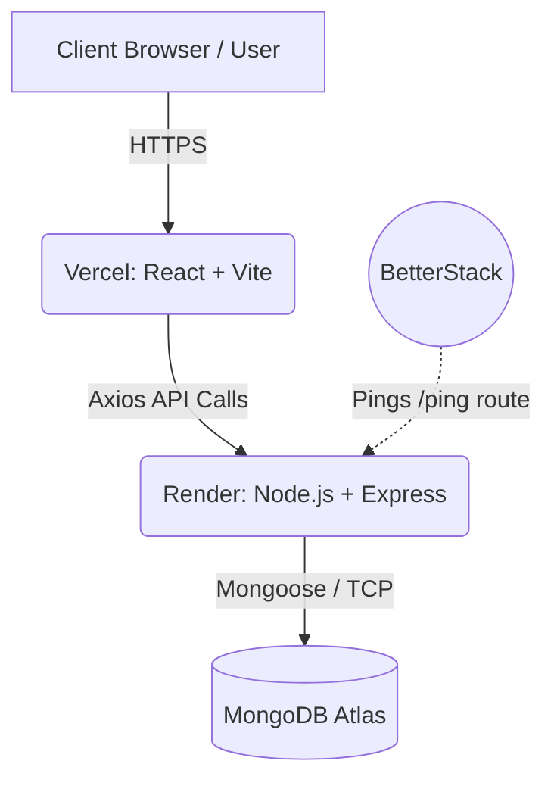

# Brainly 🧠 — Second-Brain / Knowledge Hub

**Brainly** is a minimal knowledge-hub application to capture ideas, notes, tasks, and resources — all in one place. It emphasizes clarity, fast search, and simple organization, helping you think better, learn faster, and revisit important insights anytime.

---

## 🔎 Table of Contents

- [About the App](#about-the-app)
- [Real Life Use Cases](#real-life-use-cases)
- [Why I Built It](#why-i-built-it)
- [Workflow](#workflow)
- [Tech Stack & Deployment](#tech-stack--deployment)
- [Architecture & Diagrams](#architecture--diagrams)
- [Future Upgrades](#future-upgrades)
- [Project Setup](#project-setup)

---

## 📖 About the App

Brainly acts as your digital "Second Brain," allowing you to offload your thoughts, URLs, ideas, and multimedia into an organized, easily retrievable system. It provides a clutter-free environment to store knowledge chunks securely and fetch them whenever you need them.

## 🌍 Real Life Use Cases

- **Researchers & Students:** Store links to papers, jot down quick study notes, and organize resources by topics for fast retrieval.
- **Developers & Engineers:** Keep track of useful documentation links, code snippets, and architecture ideas without losing them in endless browser bookmarks.
- **Content Creators:** Save tweets, YouTube videos, and sudden bursts of inspiration to review later when drafting content.
- **Everyday Life Management:** Keep a unified repository of interesting articles, recipes, and personal tasks.

## 💡 Why I Built It

In an age of information overload, it's incredibly easy to stumble across valuable resources—a profound tweet, an insightful video, or a brilliant article—and then completely lose track of them. Standard bookmarks are messy and lack context. I built Brainly to solve my own problem of fragmented knowledge. By centralizing everything into a single, clean interface where data is strictly typed and securely stored, I can focus on *learning* rather than *searching*.

---

## ⚙️ Workflow

1. **User Registration:** Users sign up and log in securely. Authentication is handled via JWT tokens.
2. **Content Creation:** The user inputs a thought, a YouTube link, or a Tweet URL.
3. **Data Handling:** The frontend strictly validates the input, and the backend stores it in MongoDB.
4. **Knowledge Retrieval:** The dashboard fetches and renders embedded content dynamically (e.g., rendering actual YouTube players or Twitter cards).
5. **Brain Sharing:** Users can generate a unique sharing link to grant others read-only access to their specific knowledge base.

---

## 💻 Tech Stack & Deployment

### Tech Stack
| Layer / Concern      | Technology / Library                  |
|---------------------|-------------------------------------|
| Frontend            | React, TypeScript, Vite, react-router-dom |
| Styling / UI        | Tailwind CSS                        |
| Backend             | Node.js, Express, TypeScript, Mongoose     |
| Database            | MongoDB                            |
| Auth & Security     | bcrypt                            |
| Validation          | Zod                               |
| IDs                 | nanoid                            |

### Deployment Architecture
- **Frontend:** Deployed on **Vercel** for fast global CDN delivery and instant static rendering.
- **Backend:** Hosted on **Render** using a web service.
- **Uptime Management:** Integrated with **BetterStack**. A dedicated `/ping` endpoint on the backend is hit periodically by BetterStack to prevent the Render free-tier server from going to sleep, ensuring zero cold-start delays.

---

## 🏗 Architecture & Diagrams

### System Architecture Diagram


### Replication in System
- **Frontend:** Vercel automatically replicates the static assets across its global edge network, ensuring users load the UI from the closest geographical node.
- **Database:** MongoDB Atlas manages replica sets under the hood, ensuring data redundancy, failover protection, and high availability.

### Folder Structure Diagram
```text
Brainly/
├── backend/                  # Node.js + Express API
│   ├── src/
│   │   ├── middleware/       # JWT Auth Middlewares
│   │   ├── Nanoid/           # Unique Share Link generation
│   │   ├── Router/           # API Endpoints (user.ts)
│   │   ├── db.ts             # Mongoose Schemas & Connections
│   │   └── index.ts          # Express Entry & Ping Route
│   ├── .env                  
│   └── package.json          
└── frontend/                 # React + Vite + TS Frontend
    ├── public/
    ├── src/
    │   ├── components/       # Reusable UI, Hooks, Icons, Util (API configuration)
    │   ├── Pages/            # React Router Views (DashBoard, LogIn, SignUp, Sharepage)
    │   ├── App.tsx           # Router Configuration
    │   └── main.tsx          # React DOM Mount
    ├── tailwind.config.js    
    ├── vite.config.ts        
    └── package.json          
```

---

## 🚀 Future Upgrades

- 🔍 **Full-text search:** Advanced indexing to search deep within note content.
- 🏷 **Tagging system:** Multi-label categorization for better filtering.
- ☁️ **Cloud upload:** Direct file and image attachments using AWS S3 or Cloudinary.
- 📱 **Mobile App:** A React Native version for seamless on-the-go knowledge capture.
- 🤖 **AI Integration:** Auto-summarization of saved articles and YouTube videos using LLMs.

---

## 🖼 Gallery / Screenshots


---

## 💻 Project Setup

### 1️⃣ Clone the Repository
```bash
git clone https://github.com/bhavesh10joshi/Brainly.git
cd Brainly
```

### 2️⃣ Install Backend Dependencies
```bash
cd backend
npm install
```

### 3️⃣ Install Frontend Dependencies
```bash
cd ../frontend
npm install
```

### 🔐 Environment Variables
Create a `.env` file inside `backend`:
```env
DB_URL=<your-MongoDB-connection-string>
USER_SECRET=<your-user-jwt-secret>
PORT_NO=3000
```

Create a `.env` file inside `frontend`:
```env
VITE_BACKEND_URL=http://localhost:3000/api/v1
```

### ▶️ Running the Project
**Start Backend:**
```bash
cd backend
npm run dev
```

**Start Frontend:**
```bash
cd frontend
npm run dev
```
